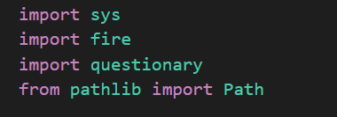
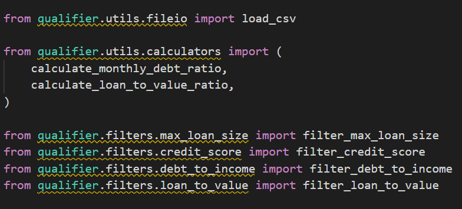
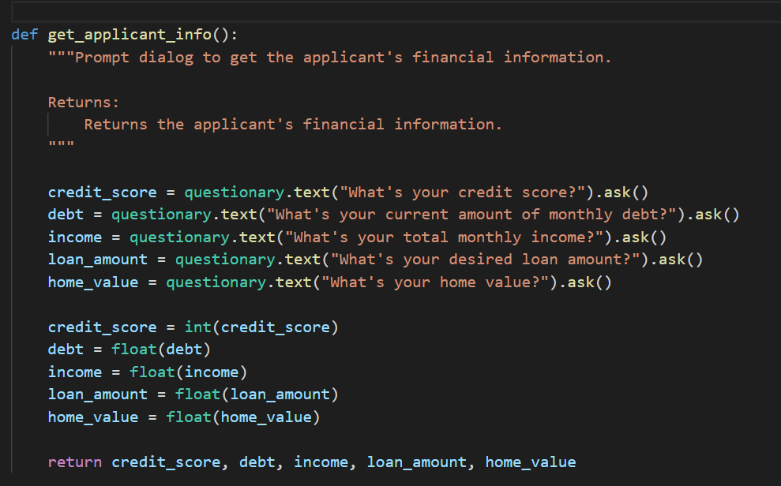

# Loan Qualifier Application


Uses Python to match potential loan borrowers with various banks in a list based on filtering through standard customer data such as credit scores, debt-to-income ratio, etc.

---

## Technologies

Uses python to filter through a list of banks with their terms and parameters to match up to potential borrowers using customer data through financial calculations such as Loan-to_value ratios, debt-to-income ratios. It will take that customer data and tell the customer how many loans are available based on their financial data and which banks will accept them.

---

## Installation Guide

User will want to make sure that fire and questionary are installed. 

```pip install fire```

```pip install questionary```

User will need to be able to import libraries to call on functions within the app.




---

## Usage

This app queries the customer on various financial data to match qualifying loans. 

Loan qualification criteria is based on:
        - Credit Score
        - Loan Size
        - Debit to Income ratio (calculated)
        - Loan to Value ratio (calculated)
        
User will want to make sure that they are importing externally held calculators:



Therefore the application imports various banks and uses the following arguments to match loans:

        credit_score (int): The applicant's current credit score.
        debt (float): The applicant's total monthly debt payments.
        income (float): The applicant's total monthly income.
        loan (float): The total loan amount applied for.
        home_value (float): The estimated home value.

It will grab bank data from a csv (included in the repo):

 ```python
       def load_bank_data():
    """Ask for the file path to the latest banking data and load the CSV file.

    Returns:
        The bank data from the data rate sheet CSV file.
    """

    csvpath = questionary.text("data\daily_rate_sheet.csv").ask()
    csvpath = Path(csvpath)
    if not csvpath.exists():
        sys.exit(f"Oops! Can't find this path: {csvpath}")

    return load_csv(csvpath)
 ```

Then importantly the application will query the user to enter their information as the applicant. 



The application will then run the arguments to match qualifying loans to the applicants. Then it will ask the applicant if they would like to save the file accordingly.

```python
     bank_data_filtered = filter_max_loan_size(loan, bank_data)
    bank_data_filtered = filter_credit_score(credit_score, bank_data_filtered)
    bank_data_filtered = filter_debt_to_income(monthly_debt_ratio, bank_data_filtered)
    bank_data_filtered = filter_loan_to_value(loan_to_value_ratio, bank_data_filtered)

    print(f"Found {len(bank_data_filtered)} qualifying loans")

    return bank_data_filtered

def save_qualifying_loans(qualifying_loans):
    """Saves the qualifying loans to a CSV file.

    Args:
        qualifying_loans (list of lists): The qualifying bank loans.
    """
    # @TODO: Complete the usability dialog for savings the CSV Files.

    qualifying_loans = questionary.confirm("Do you want to save your qualifying loans?").ask()
    csvpath = questionary.text("Enter a file path to a qualifying loans sheet (.csv)").ask()
    csvpath = Path('qualifying_loans.csv')
    save_csv(csvpath, qualifying_loans)
 ```


---

## Contributors

Daniel McCaffrey - [LinkedIn](https://www.linkedin.com/in/mccaffreydanny/), [E-mail](mailto:McCaffrey.danny@gmail.com)

---


## License

This project is licensed under the UW FinTech Bootcamp Fall 2021. All derivates of the work should be open source and credited as such.

